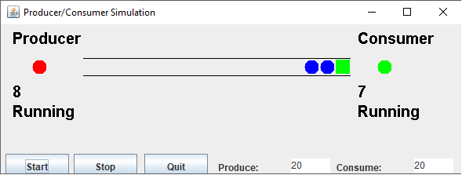

# Exemplo do problema Produtor-Consumidor

Para poder funcionar, es necesario realizar mudancas na classe:`MyQueue` que seria uma implementacao de uma Fila.

Metodos a implementar:
- `enqueue`: adicionar um elemento no final da fila.
- `dequeue`: tira o primeiro elemento da fila.
- `getContents`: gera uma copia dos dados da Fila e adiciona dentro do attributo `queueContents`. 

Atividade inspirada em: 
[CS 365: Lab 10: Java Producer/Consumer Simulation](https://ycpcs.github.io/cs365-spring2019/labs/lab10.html)

